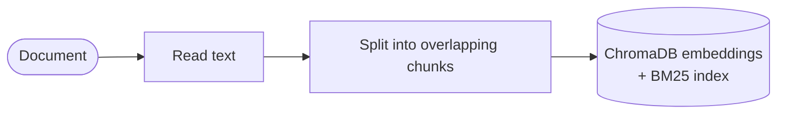
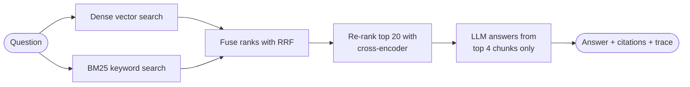
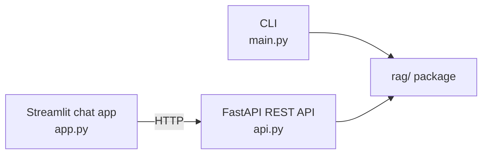

# سیستم پرسش‌وپاسخ اسنادی RAG

[English](README.md) | **فارسی**

[](https://github.com/saberfazliahmadi/rag-document-qa/actions/workflows/ci.yml)
[](LICENSE)
[](https://www.python.org/downloads/)

<div dir="rtl">

**یک سیستم RAG ارزیابی‌محور.** از اسناد خودتان سؤال بپرسید و پاسخ‌هایی مستند و دارای ارجاع به منبع بگیرید — از خط لوله‌ای که در آن هر تصمیم معماری، پیش از آنکه به آن اعتماد شود، اندازه‌گیری می‌شود.

صدها مخزن نشان می‌دهند که چگونه یک خط لوله RAG *بسازید*. این مخزن به سؤال‌هایی پاسخ می‌دهد که بعد از ساختن پیش می‌آیند:

- **از کجا می‌دانید بازیابی (Retrieval) شما درست کار می‌کند؟** یک مجموعه‌داده طلایی (Golden Dataset) و دو معیار قطعی، هر پیکربندی را محک می‌زنند — نتایج در جدول پایین.
- **هر مؤلفه واقعاً چه چیزی به سیستم اضافه می‌کند؟** جستجوی ترکیبی (Hybrid) نرخ اصابت را از ۰٫۹۶ به ۱٫۰۰ رساند. رتبه‌بندی مجدد (Re-ranking) معیار MRR را از ۰٫۸۷ به ۰٫۹۲ رساند — و در همین مسیر، یک سؤال را خراب کرد.
- **یک پاسخ اشتباه را چگونه دیباگ می‌کنید؟** هر سؤال یک ردیابی بازیابی (Retrieval Trace) برمی‌گرداند که نشان می‌دهد هر مرحله چه چیزی را در چه رتبه‌ای قرار داده است؛ بنابراین هر خطا، علت خودش را نام می‌برد.
- **چگونه جلوی افت بی‌صدای کیفیت را می‌گیرید؟** CI هر تغییری را که کیفیت بازیابی را زیر آستانه‌های اندازه‌گیری‌شده بیاورد، رد می‌کند.

اگر سیستم RAG می‌سازید یا نگهداری می‌کنید، مفیدترین فایل این مخزن [کالبدشکافی یک خطای بازیابی](docs/anatomy-of-a-retrieval-failure.md) است — یک پسرفت واقعی از محکِ خودِ همین مخزن، که مرحله‌به‌مرحله تشریح شده است.

</div>


<div dir="rtl">

## این سیستم چه می‌کند؟

اسنادتان را به آن می‌دهید (PDF، Word، متن یا Markdown). سیستم آن‌ها را در یک پایگاه‌داده برداری محلی نمایه می‌کند. سپس از طریق **خط فرمان (CLI)**، **REST API** یا **اپ چت تحت وب**، به زبان ساده سؤال می‌پرسید و یک مدل زبانی بزرگ (LLM) **فقط بر اساس اسناد شما** پاسخ می‌دهد — با ذکر دقیق اینکه پاسخ از کدام بخشِ کدام فایل آمده است. اگر پاسخ در اسناد شما نباشد، به‌جای حدس زدن می‌گوید «نمی‌دانم».

اصلاً چرا RAG؟ مدل‌های زبانی بزرگ دو مشکل شناخته‌شده دارند: گاهی واقعیت‌ها را از خود می‌سازند («توهم» یا Hallucination) و از فایل‌های خصوصی شما هیچ چیزی نمی‌دانند. RAG هر دو مشکل را حل می‌کند: مدل را مجبور می‌کند فقط از متنِ بازیابی‌شده از اسناد شما پاسخ دهد، با ارجاع‌هایی که انسان می‌تواند بررسی کند.

## ویژگی‌های کلیدی

- **بازیابی دومرحله‌ای** — جستجوی ترکیبی (برداری + BM25 با ادغام Reciprocal Rank Fusion) و سپس رتبه‌بندی مجدد با Cross-Encoder؛ همان معماری موتورهای جستجوی وب
- **ارزیابی داخلی** — مجموعه‌داده طلایی و معیارهای قطعی ثابت می‌کنند هر مرحله بازیابی چه سهمی دارد (جدول محک در ادامه)
- **دروازه پسرفت بازیابی در CI** — تغییری که کیفیت بازیابی را پایین بیاورد، به‌طور خودکار بیلد را رد می‌کند
- **ردیابی بازیابی برای هر سؤال** — هر مرحله چه چیزی را در چه رتبه‌ای گذاشته، با امتیازها و زمان‌ها؛ در اپ وب («چرا این پاسخ؟»)، در خروجی API، در CLI و در لاگ‌های JSON
- **پاسخ‌های مستند با ارجاع** — هر پاسخ، فایل و قطعه‌ای (Chunk) را که از آن ساخته شده فهرست می‌کند
- **سه رابط، یک هسته** — پکیج `rag/` هیچ کد رابط کاربری ندارد
- **محافظ‌های تولیدی (Production)** — مهلت زمانی (Timeout) و تلاش مجدد خودکار برای فراخوانی‌های LLM، سقف حجم آپلود، مدیریت مؤدبانه پاسخ‌های خالیِ ارائه‌دهنده
- **تست‌شده و Lint شده** — ۳۷ تست واحد، ruff و دروازه ارزیابی، همگی در CI

## چگونه کار می‌کند؟

**ورود اسناد (Ingestion)** — اسناد به قطعه‌های قابل جستجو تبدیل می‌شوند:

</div>



<div dir="rtl">

**پاسخ به سؤال** — دو مرحله بازیابی، سپس تولید مستند:

</div>



<div dir="rtl">

**رابط‌ها** — لایه‌های نازک روی یک هسته مشترک:

</div>



<div dir="rtl">

هر ماژول مسئول یک وظیفه است:

| ماژول | وظیفه |
|---|---|
| `rag/loaders.py` | خواندن فایل‌های PDF / DOCX / TXT / MD به متن ساده |
| `rag/splitter.py` | برش متن به قطعه‌های هم‌پوشان |
| `rag/store.py` | نمایه برداری ChromaDB + نمایه کلیدواژه‌ای BM25، در کنار هم |
| `rag/ranking.py` | ادغام Reciprocal Rank Fusion + رتبه‌بند مجدد Cross-Encoder |
| `rag/retriever.py` | ترکیب خط لوله بازیابی دومرحله‌ای |
| `rag/trace.py` | ثبت آنچه هر مرحله دیده است (مشاهده‌پذیری) |
| `rag/pipeline.py` | بازیابی + تولید مستند با ارجاع |
| `rag/config.py` | همه تنظیمات از متغیرهای محیطی |

## چرا بازیابی دومرحله‌ای؟

جستجوی برداری متراکم (Dense) و جستجوی کلیدواژه‌ای در جهت‌های مخالف شکست می‌خورند:

- **جستجوی برداری** *معنا* را پیدا می‌کند، پس با بازنویسی عبارت مشکلی ندارد: «کاهش پاسخ‌های ساختگی» متنی درباره «توهم» را پیدا می‌کند. اما در واژه‌های دقیق ضعیف است — شماره مدل‌ها، سرواژه‌ها و شناسه‌های نادر معمولاً به‌خوبی جاسازی (Embed) نمی‌شوند.
- **جستجوی کلیدواژه‌ای BM25** *واژه‌های دقیق* را پیدا می‌کند، اما مترادف‌ها را نمی‌بیند: پرسشی درباره «خودرو» هرگز با قطعه‌ای که فقط «اتومبیل» نوشته منطبق نمی‌شود.

چون شکست‌هایشان مکمل هم است، این پروژه هر دو را اجرا می‌کند و فهرست‌های رتبه‌بندی‌شده را با **Reciprocal Rank Fusion (RRF)** ادغام می‌کند. RRF امتیازهای خام را کاملاً نادیده می‌گیرد و فقط از رتبه‌ها استفاده می‌کند — امتیازهای BM25 و فاصله‌های برداری در مقیاس‌های غیرقابل‌مقایسه‌اند و RRF بدون هیچ تنظیم و داده آموزشی، این مشکل را دور می‌زند.

جستجوی ترکیبی **بازیابی جامع (Recall)** را بهبود می‌دهد: قطعه درست جایی در فهرست نامزدهاست. سپس **رتبه‌بند مجدد Cross-Encoder** دقت (Precision) را بهبود می‌دهد: قطعه درست در همان چند قطعه نهایی است که LLM واقعاً می‌بیند. Cross-Encoder سؤال و هر نامزد را *با هم* می‌خواند و همین آن را بسیار دقیق‌تر از فاصله جاسازی می‌کند — و بسیار کندتر از آنکه بشود کل مجموعه را با آن امتیازدهی کرد؛ به همین دلیل فقط ۲۰ نامزد برتر را امتیاز می‌دهد.

ارزان و گسترده بازیابی کن، سپس محدود و دقیق رتبه‌بندی کن. هر مرحله اختیاری و قابل پیکربندی است (`SEARCH_MODE`، `USE_RERANKER`) — و مهم‌تر از آن، هر مرحله اندازه‌گیری می‌شود:

## ارزیابی — اندازه‌گیری، نه فرض

پکیج `eval/` شامل یک مجموعه ثابت ۴۱ قطعه‌ای درباره مهندسی RAG و یک مجموعه‌داده طلایی با ۲۵ سؤال است که هر کدام با متنِ شاهدِ پاسخ‌دهنده برچسب خورده‌اند. دو معیار قطعی:

- **نرخ اصابت در k (Hit rate@k)** — برای چه کسری از سؤال‌ها، شاهد در k قطعه برتر بازیابی‌شده است؟
- **MRR** (میانگین رتبه معکوس) — شاهد چقدر *زود* ظاهر می‌شود؟ رتبه ۱ امتیاز ۱٫۰ می‌گیرد، رتبه ۴ امتیاز ۰٫۲۵.

نتایج اندازه‌گیری‌شده (`python -m eval.run`، با top_k = 4):

| پیکربندی | Hit rate@4 | MRR |
|---|---|---|
| جستجوی برداری متراکم (پایه) | 0.96 | 0.77 |
| ترکیبی: BM25 + RRF | **1.00** | 0.87 |
| ترکیبی + رتبه‌بندی مجدد Cross-Encoder | 0.96 | **0.92** |

آنچه این اعداد می‌گویند — و همین صداقت، هدف اصلی ارزیابی است:

- **جستجوی ترکیبی خطای پیکربندی پایه را برطرف کرد** و MRR را ۱۰ واحد بالا برد. سؤال‌های واژه-دقیق («مقدار پیش‌فرض رایج efConstruction چیست؟») که جستجوی متراکم در آن‌ها می‌لغزد، توسط BM25 گرفته می‌شوند.
- **رتبه‌بندی مجدد MRR را از ۰٫۸۷ به ۰٫۹۲ رساند** — شاهد به *بالای* پنجره زمینه می‌رود، نه فقط داخل آن.
- **رتبه‌بندی مجدد یک سؤال را هم خراب کرد.** Cross-Encoder قطعه‌های محتملِ دیگری را بالاتر از شاهد امتیاز داد. یک مدلِ بهتر، همه‌جا بهتر نیست — و بدون مجموعه ارزیابی، این پسرفت نامرئی می‌ماند.

این معیارها به LLM و کلید API نیاز ندارند، پس در CI روی هر push اجرا می‌شوند: **دروازه پسرفت** (`python -m eval.run --check`) اگر نرخ اصابت یا MRR زیر آستانه‌ها بیفتد، بیلد را رد می‌کند. کیفیت بازیابی همان‌طور محافظت می‌شود که تست‌های واحد از رفتار محافظت می‌کنند.

</div>

```bash
python -m eval.run              # محک زدن هر سه پیکربندی
python -m eval.run --verbose    # به‌علاوه فهرست سؤال‌های ازدست‌رفته
python -m eval.run --check      # دروازه پسرفت (همان که CI اجرا می‌کند)
```

<div dir="rtl">

**این اعداد را چگونه بخوانیم؟** این‌ها مقایسه‌های تکرارپذیر *درون همین مخزن* هستند، نه محک جهانی RAG — مجموعه، سؤال‌ها و معیارها ثابت‌اند تا تغییرات معماری در شرایط یکسان مقایسه شوند. دو نتیجه: اول، اعداد را نسبی بخوانید: «ترکیبی اینجا از متراکم بهتر است» قابل اعتماد است؛ «این سیستم به‌طور کلی ۰٫۹۶ می‌گیرد» نه. دوم، امتیازهای مطلق خوش‌بینانه‌اند، چون سؤال‌های طلایی و مجموعه را یک نویسنده نوشته است (سؤال‌های کاربران واقعی نامرتب‌ترند). این همان انضباطی است که تیم‌های تولیدی به کار می‌برند: یک محک داخلی ثابت برای مقایسه تغییرات، که به‌مرور با پرسش‌های واقعی کاربران تازه می‌شود.

## دیباگ: چرا این پاسخ را داد؟

هر سؤال یک **ردیابی بازیابی** تولید می‌کند: هر مرحله چه چیزی را در چه رتبه‌ای گذاشته، با امتیازها و زمان‌ها. اپ وب آن را زیر «چرا این پاسخ؟» نشان می‌دهد، API در فیلد `trace` برمی‌گرداند، سرور به‌صورت یک خط JSON لاگ می‌کند و CLI با یک پرچم چاپ می‌کند. خروجی واقعی:

</div>

```text
$ python main.py ask "What is YOLOv7?" --show-trace
...
=== RETRIEVAL TRACE (hybrid, 6618.1 ms) ===
dense           38.8 ms  top: yolov7_paper.pdf_chunk_2(-0.3991), yolov7_paper.pdf_chunk_73(-0.4036), ...
bm25             0.6 ms  top: sample.txt_chunk_0(6.2495), yolov7_paper.pdf_chunk_2(4.7575), ...
rrf_fusion       0.1 ms  top: yolov7_paper.pdf_chunk_2(0.0325), yolov7_paper.pdf_chunk_73(0.032), ...
rerank        6578.5 ms  top: yolov7_paper.pdf_chunk_0(5.9639), yolov7_paper.pdf_chunk_65(4.2802), ...
```

<div dir="rtl">

(زمان رتبه‌بندی مجدد در اینجا شامل بارگذاری یک‌باره مدل Cross-Encoder است — CLI برای هر فرمان فرایند تازه‌ای می‌سازد. سرور API مدل را یک بار در شروع بارگذاری می‌کند و رتبه‌بندی مجددش کسری از ثانیه است. ردیابی دقیقاً همین نوع هزینه‌ها را آشکار می‌کند.)

با یک ردیابی، «پاسخ اشتباه است» تبدیل می‌شود به «شاهد بعد از ادغام در رتبه ۳ بود و رتبه‌بند مجدد آن را به رتبه ۱۰ فرستاد» — جمله‌ای که مؤلفه، سازوکار و راه‌حل را نام می‌برد.

این جمله فرضی نیست. محکِ خودِ همین مخزن سؤالی دارد که جستجوی ترکیبی درست پاسخ می‌دهد و رتبه‌بندی مجدد خرابش می‌کند. **[کالبدشکافی یک خطای بازیابی](docs/anatomy-of-a-retrieval-failure.md)** آن را مرحله‌به‌مرحله با امتیازهای واقعی تشریح می‌کند: چرا Cross-Encoder قطعه درست را پایین می‌فرستد، چهار راه‌حل بررسی‌شده و چرا «بپذیر و مستند کن» برنده شد. اگر فقط یک فایل از این مخزن می‌خوانید، همان را بخوانید.

## نصب

**۱. کلون و نصب**

</div>

```bash
git clone https://github.com/saberfazliahmadi/rag-document-qa.git
cd rag-document-qa

python -m venv .venv
# Windows:
.venv\Scripts\activate
# macOS / Linux:
source .venv/bin/activate

pip install -r requirements.txt
```

<div dir="rtl">

**۲. پیکربندی کلید API**

</div>

```bash
# Windows:
copy .env.example .env
# macOS / Linux:
cp .env.example .env
```

<div dir="rtl">

فایل `.env` را باز کنید و `OPENROUTER_API_KEY` را با کلیدتان از [openrouter.ai/keys](https://openrouter.ai/keys) مقداردهی کنید. مدل پیش‌فرض رایگان است.

اولین اجرا دو مدل محلی کوچک دانلود می‌کند (جاساز و رتبه‌بند مجدد، هر کدام حدود ۹۰ مگابایت)؛ اجراهای بعدی سریع شروع می‌شوند.

## استفاده

### رابط وب (پیشنهادی)

اول API و بعد اپ چت را اجرا کنید (دو ترمینال):

</div>

```bash
uvicorn api:app
streamlit run app.py
```

<div dir="rtl">

آدرس http://localhost:8501 را باز کنید، سندی در نوار کناری آپلود کنید و سؤال بپرسید. پاسخ‌ها کلمه‌به‌کلمه استریم می‌شوند، هر کدام با پنل‌های بازشونده **Sources** و **Why this answer?**.

REST API به‌تنهایی هم کار می‌کند — مستندات تعاملی در http://127.0.0.1:8000/docs:

| Endpoint | متد | کاربرد |
|---|---|---|
| `/ingest` | POST | آپلود سند (فایل multipart، با سقف حجم) |
| `/ask` | POST | پرسیدن سؤال ← پاسخ JSON با منابع و ردیابی |
| `/ask/stream` | POST | همان، اما پاسخ توکن‌به‌توکن استریم می‌شود (SSE) |
| `/status` | GET | تعداد قطعه‌ها و مدل‌های پیکربندی‌شده |

### خط فرمان

</div>

```bash
python main.py ingest data/sample.txt paper.pdf   # افزودن اسناد
python main.py ask "What are the main benefits of RAG?"
python main.py ask "..." --show-trace             # همراه با ردیابی بازیابی
python main.py chat                               # جلسه تعاملی
python main.py status                             # چه چیزی ذخیره شده
```

<div dir="rtl">

## پیکربندی

همه تنظیمات مقدار پیش‌فرض کارا دارند و در `.env` قابل بازنویسی‌اند:

| متغیر | پیش‌فرض | معنا |
|---|---|---|
| `OPENROUTER_API_KEY` | — (الزامی) | کلید API شما در OpenRouter |
| `LLM_MODEL` | `meta-llama/llama-3.3-70b-instruct:free` | مدل چت برای پاسخ‌ها |
| `EMBEDDING_MODEL` | `all-MiniLM-L6-v2` | مدل جاسازی Sentence-Transformer |
| `CHUNK_SIZE` | `500` | تعداد نویسه هر قطعه |
| `CHUNK_OVERLAP` | `100` | نویسه‌های مشترک بین قطعه‌های مجاور |
| `SEARCH_MODE` | `hybrid` | `hybrid` (برداری + BM25) یا `dense` (فقط برداری) |
| `CANDIDATES` | `20` | نامزدهای مرحله اول پیش از برش نهایی top-k |
| `USE_RERANKER` | `true` | امتیازدهی مجدد نامزدها با Cross-Encoder |
| `RERANKER_MODEL` | `cross-encoder/ms-marco-MiniLM-L-6-v2` | مدل محلی رتبه‌بندی مجدد |
| `TOP_K` | `4` | قطعه‌های تحویلی به LLM برای هر سؤال |
| `LLM_TIMEOUT` | `60` | ثانیه تا رها کردن فراخوانی LLM |
| `LLM_MAX_RETRIES` | `3` | تلاش‌های مجدد خودکار با backoff روی 429/5xx |
| `MAX_UPLOAD_MB` | `25` | سقف حجم آپلود برای `/ingest` |
| `TEMPERATURE` | `0.2` | کمتر = پاسخ‌های واقع‌گرایانه‌تر |
| `MAX_TOKENS` | `512` | حداکثر طول پاسخ |

تنظیمی از بازیابی را عوض کردید؟ `python -m eval.run` را دوباره اجرا کنید و بگذارید اعداد تصمیم بگیرند.

## تصمیم‌های طراحی

انتخاب‌هایی که یک مهندس درباره‌شان می‌پرسد، همراه با دلیل:

- **RRF به‌جای نرمال‌سازی امتیاز.** امتیازهای BM25 و فاصله‌های برداری قابل مقایسه نیستند و ادغام یادگیرنده به داده آموزشی نیاز دارد. RRF فقط از رتبه‌ها استفاده می‌کند، یک ثابت خوش‌مطالعه دارد و در اکثر موتورهای دارای جستجوی ترکیبی پیش‌فرض است. ساده و درست، بهتر از هوشمندانه.
- **معیارهای دست‌ساز ~۶۰ خطی به‌جای فریم‌ورک ارزیابی.** نرخ اصابت و MRR حساب شفاف‌اند؛ فریم‌ورک همان ریاضی‌ای را پنهان می‌کرد که این مخزن سعی دارد آموزش دهد. معیارهای LLM-داور (مثل Faithfulness) عمداً بیرون از CI مانده‌اند — پرنوسان‌اند، هزینه دارند و با مدلِ داور جابه‌جا می‌شوند. معیارهای قطعی بیلد را دروازه‌بانی می‌کنند.
- **نمایه BM25 در حافظه و بازسازی هنگام شروع.** در این مقیاس مناسب، در میلیون‌ها قطعه اسراف است — سیستم تولیدی نمایه کلیدواژه‌ای را در موتور جستجو (OpenSearch، Elasticsearch) نگه می‌دارد. این درز در `store.py` جدا شده تا آن تعویض فقط به یک ماژول دست بزند.
- **مجموعه طلایی کوچک است (۲۵ سؤال) و مجموعه ثابت.** برای آشکار کردن تفاوت‌های واقعی بین پیکربندی‌ها — از جمله پسرفتی که رتبه‌بند مجدد ایجاد کرد — کافی است، و همچنان در یک نشست برای انسان قابل مرور می‌ماند.
- **قطعه‌های ۵۰۰ نویسه‌ای با ۱۰۰ هم‌پوشانی** پیش‌فرضِ اندازه‌گیری‌شده‌اند، نه حقیقت. نکته اصلی، خودِ روال است (تغییر بده، دوباره اندازه بگیر)، نه اعداد.
- **ردیابی به‌جای داشبورد.** مشاهده‌پذیری در اینجا یک خط JSON برای هر سؤال است، با رتبه‌ها، امتیازها و زمان‌های هر مرحله — بدون هیچ زیرساختی برای پاسخ به «چرا آن را بازیابی کرد؟» کافی است. استقرار تولیدی این خطوط را به خط لوله لاگ موجودش می‌فرستد.

## درس‌های آموخته

درس‌هایی از ساخت این پروژه که به هر سیستم RAG منتقل می‌شوند:

۱. **بدون ارزیابی، هر تصمیم یک حدس است.** اندازه قطعه، حالت جستجو، تعداد قطعه‌های بازیابی — هر کدام کیفیت پاسخ را طوری تغییر می‌دهند که با نگاه کردن به چند سؤال قابل تشخیص نیست. مجموعه طلایی حتی با ۲۵ سؤال، «فکر می‌کنم این کمک می‌کند» را به «این MRR را از ۰٫۸۷ به ۰٫۹۲ رساند» تبدیل می‌کند.

۲. **مؤلفه بهتر، همه‌جا بهتر نیست.** Cross-Encoder امتیاز کل را بهبود داد و یک سؤال مشخص را خراب کرد. معیارهای تجمیعی پسرفت‌های فردی را پنهان می‌کنند — نتایج تک‌سؤالی را نگه دارید، نه فقط میانگین‌ها.

۳. **خطاهای بازیابی به مرحله‌ها موضعی می‌شوند.** «پاسخ اشتباه است» قابل اقدام نیست. «شاهد بعد از ادغام رتبه ۳ بود و رتبه‌بند مجدد آن را به ۱۰ فرستاد» مؤلفه، سازوکار و راه‌حل را نام می‌برد. ردیابی را پیش از نیاز بسازید — افزودن مشاهده‌پذیری وسط حادثه، راهِ گران است.

۴. **روش‌هایی با ضعف‌های مکمل را ترکیب کنید.** جستجوی متراکم واژه‌های دقیق را از دست می‌دهد؛ BM25 مترادف‌ها را. با هم به نرخ اصابت ۱٫۰۰ رسیدند، جایی که هر کدام به‌تنهایی سؤال‌هایی را از دست می‌دادند.

۵. **مدل‌های ازپیش‌آموزش‌دیده، سوگیری داده آموزشی‌شان را وارد می‌کنند.** ترجیح رتبه‌بند مجدد برای متن‌های تعریف‌گونه، اثر انگشت MS MARCO است. ارزیابی روی داده *خودتان* راهِ فهمیدنِ محل این سوگیری‌هاست.

۶. **خطاهایی را که نمی‌توانید رفع کنید، نگه دارید.** سؤالِ خراب در مجموعه طلایی می‌ماند. هیچ هزینه‌ای ندارد، یک محدودیت شناخته‌شده را مستند می‌کند و برای رتبه‌بند مجددِ بعدی، یک تست پسرفتِ رایگان است.

## تست

</div>

```bash
pip install -r requirements-dev.txt
ruff check .                # lint
pytest                      # ۳۷ تست واحد: قطعه‌بندی، ریاضی RRF، لودرها، ردیابی، معیارها، قرارداد API
python -m eval.run --check  # دروازه پسرفت بازیابی
```

<div dir="rtl">

تست‌های API مخزن و خط لوله را با نمونه‌های ساختگی (Fake) جایگزین می‌کنند، پس در چند میلی‌ثانیه اجرا می‌شوند — بدون دانلود مدل و بدون فراخوانی LLM. CI هر سه فرمان را روی هر push اجرا می‌کند.

## ساختار پوشه‌ها

</div>

```
rag-document-qa/
├── main.py              # رابط خط فرمان
├── api.py               # FastAPI REST API (ingest, ask, stream, status)
├── app.py               # کلاینت چت Streamlit (با API صحبت می‌کند)
├── rag/                 # پکیج هسته — بدون کد رابط
│   ├── config.py        #   تنظیمات از متغیرهای محیطی
│   ├── loaders.py       #   خواننده‌های PDF / DOCX / TXT / MD
│   ├── splitter.py      #   قطعه‌بندی هم‌پوشان متن
│   ├── store.py         #   نمایه برداری ChromaDB + نمایه کلیدواژه‌ای BM25
│   ├── ranking.py       #   RRF + رتبه‌بند مجدد Cross-Encoder
│   ├── retriever.py     #   خط لوله بازیابی دومرحله‌ای
│   ├── trace.py         #   ردیابی بازیابی برای هر سؤال
│   └── pipeline.py      #   بازیابی + تولید مستند با ارجاع
├── eval/
│   ├── corpus/          # مجموعه ثابت ارزیابی (۵ سند درباره مهندسی RAG)
│   ├── golden.jsonl     # ۲۵ سؤال برچسب‌خورده با شاهدشان
│   ├── metrics.py       # Hit rate@k و MRR — قطعی، بدون LLM
│   └── run.py           # اجراکننده محک + دروازه پسرفت CI
├── docs/
│   └── anatomy-of-a-retrieval-failure.md   # یک خطای واقعی، تشریح مرحله‌به‌مرحله
├── tests/               # ۳۷ تست واحد
├── .github/workflows/   # CI: lint + تست‌ها + دروازه پسرفت بازیابی
├── data/sample.txt      # سند نمونه کوچک
├── assets/demo.gif      # دموی متحرک اپ وب
├── .env.example         # قالب پیکربندی (در .env کپی کنید)
├── requirements.txt     # وابستگی‌های اجرا
├── requirements-dev.txt # + pytest, httpx, ruff
├── LICENSE
└── README.md
```

<div dir="rtl">

پایگاه‌داده برداری هنگام اجرا در `chroma_db/` نوشته می‌شود و در مخزن قرار نمی‌گیرد.

## پشته فناوری

| لایه | فناوری |
|---|---|
| زبان | Python 3.10+ |
| پایگاه‌داده برداری | ChromaDB (محلی و ماندگار) |
| جاسازی | Sentence-Transformers (`all-MiniLM-L6-v2`) |
| جستجوی کلیدواژه‌ای | BM25 (`rank_bm25`)، ادغام با بردارها از طریق RRF |
| رتبه‌بندی مجدد | Cross-Encoder (`ms-marco-MiniLM-L-6-v2`، محلی، CPU) |
| دسترسی به LLM | OpenRouter (API سازگار با OpenAI، با timeout و retry) |
| REST API | FastAPI + Uvicorn (استریم SSE) |
| اپ وب | Streamlit |
| پردازش اسناد | pypdf، python-docx |
| کیفیت | pytest، ruff، GitHub Actions با دروازه پسرفت بازیابی |

## بهبودهای آینده

- معیارهای تولیدِ LLM-داور (Faithfulness، ربط پاسخ) به‌عنوان لایه ارزیابی اختیاری و خارج از CI
- ارجاع دقیق به صفحه برای PDFها (`file.pdf, p. 12` به‌جای شماره قطعه)
- قطعه‌بندی جمله‌آگاه — و سپس اندازه‌گیری اینکه آیا پیچیدگی‌اش می‌ارزد
- رتبه‌بند مجدد بزرگ‌تر یا تنظیم‌شده برای دامنه، ارزیابی‌شده در برابر خطای شناخته‌شده مجموعه طلایی
- فرمت‌های بیشتر (HTML، CSV) و OCR برای PDFهای اسکن‌شده
- پشتیبانی چندکاربره با مجموعه‌های جدا برای هر کاربر و احراز هویت

## مجوز

این پروژه تحت [مجوز MIT](LICENSE) منتشر شده است.

</div>
