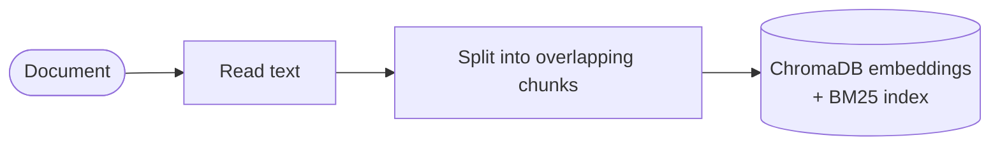
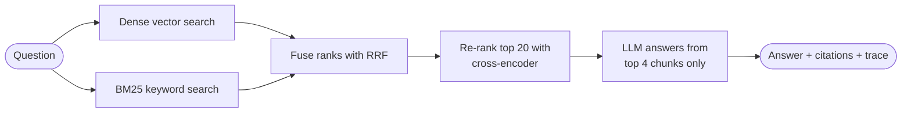
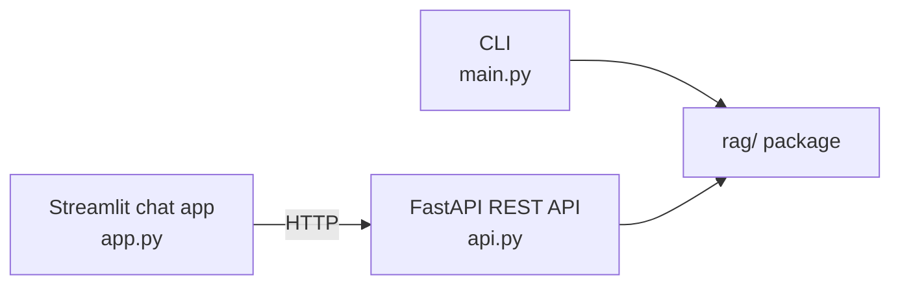

# RAG Document Q&A

[](https://github.com/saberfazliahmadi/rag-document-qa/actions/workflows/ci.yml)
[](LICENSE)
[](https://www.python.org/downloads/)

**An evaluation-first RAG system.** Ask questions about your own documents and get grounded, source-cited answers — from a pipeline where every architectural decision is measured before it is trusted.

Hundreds of repositories show how to *build* a RAG pipeline. This one answers the questions that come after building one:

- **How do you know your retrieval works?** A golden dataset and two deterministic metrics benchmark every configuration — results in the table below.
- **What does each component actually buy?** Hybrid search lifted hit rate from 0.96 to 1.00. Re-ranking lifted MRR from 0.87 to 0.92 — and broke one question doing it.
- **How do you debug a wrong answer?** Every question returns a retrieval trace showing what each stage ranked where, so a failure names its own cause.
- **How do you keep quality from silently regressing?** CI fails any change that drops retrieval below measured thresholds.

If you build or maintain RAG systems, the most useful file here is [Anatomy of a Retrieval Failure](docs/anatomy-of-a-retrieval-failure.md) — a real regression from this repository's own benchmark, dissected stage by stage.


## What It Does

You give it documents (PDF, Word, text, or Markdown). It indexes them in a local vector database. You ask questions in plain language through a **CLI**, a **REST API**, or a **web chat app**, and a large language model answers **using only your documents** — citing exactly which parts of which files the answer came from. If the answer is not in your documents, it says "I don't know" instead of guessing.

Why RAG at all? Large language models have two well-known problems: they sometimes invent facts ("hallucination"), and they know nothing about your private files. RAG fixes both by forcing the model to answer only from text retrieved out of your documents, with citations a human can check.

## Key Features

- **Two-stage retrieval** — hybrid search (vector + BM25, fused with Reciprocal Rank Fusion) followed by cross-encoder re-ranking; the same architecture web search engines use
- **Built-in evaluation** — a golden dataset and deterministic metrics prove what each retrieval stage contributes (benchmark table below)
- **Retrieval regression gate in CI** — a change that degrades retrieval quality fails the build automatically
- **Retrieval traces on every question** — what each stage ranked where, with scores and latencies; shown in the web app ("Why this answer?"), returned by the API, printed by the CLI, logged as JSON
- **Grounded answers with citations** — every answer lists the file and chunk it was built from
- **Three interfaces, one core** — the `rag/` package contains zero interface code
- **Production guardrails** — LLM timeouts and automatic retries, upload size limits, graceful handling of empty provider responses
- **Tested and linted** — 37 unit tests, ruff, and the eval gate, all in CI

## How It Works

**Ingestion** — documents become searchable chunks:



**Question answering** — two retrieval stages, then grounded generation:



**Interfaces** — thin layers over one shared core:



Each module owns one concern:

| Module | Concern |
|---|---|
| `rag/loaders.py` | Read PDF / DOCX / TXT / MD files into plain text |
| `rag/splitter.py` | Cut text into overlapping chunks |
| `rag/store.py` | ChromaDB vector index + BM25 keyword index, side by side |
| `rag/ranking.py` | Reciprocal Rank Fusion + cross-encoder re-ranking |
| `rag/retriever.py` | Compose the two-stage retrieval pipeline |
| `rag/trace.py` | Record what every stage saw (observability) |
| `rag/pipeline.py` | Retrieval + grounded generation with citations |
| `rag/config.py` | All settings from environment variables |

## Why Two-Stage Retrieval?

Dense vector search and keyword search fail in opposite ways:

- **Vector search** finds *meaning*, so it handles paraphrase: "reducing made-up answers" finds a passage about "hallucination". But it is weak on exact terms — model numbers, acronyms, and rare identifiers often embed poorly.
- **BM25 keyword search** finds *exact terms*, but it cannot see synonyms: a query about "cars" never matches a chunk that only says "automobiles".

Because the failure modes are complementary, this project runs both and merges the ranked lists with **Reciprocal Rank Fusion (RRF)**. RRF ignores raw scores entirely and uses only ranks — BM25 scores and vector distances live on incomparable scales, and RRF sidesteps that problem with no tuning and no training data.

Hybrid search improves **recall**: the right chunk is somewhere in the candidate list. A **cross-encoder re-ranker** then improves **precision**: the right chunk is in the final few the LLM actually sees. A cross-encoder reads the query and a candidate *together*, which makes it far more accurate than embedding distance — and far too slow for a whole corpus, which is why it only scores the top 20 candidates.

Retrieve cheap and wide, then re-rank narrow and precise. Every stage is optional and configurable (`SEARCH_MODE`, `USE_RERANKER`) — and every stage is measured:

## Evaluation — Measured, Not Assumed

The `eval/` package contains a fixed 41-chunk corpus about RAG engineering and a golden dataset of 25 questions, each labeled with the evidence text that answers it. Two deterministic metrics:

- **Hit rate@k** — for what fraction of questions is the evidence in the top k retrieved chunks?
- **MRR** (Mean Reciprocal Rank) — how *early* does the evidence appear? Rank 1 scores 1.0, rank 4 scores 0.25.

Measured results (`python -m eval.run`, top_k = 4):

| Configuration | Hit rate@4 | MRR |
|---|---|---|
| Dense vector search (baseline) | 0.96 | 0.77 |
| Hybrid: BM25 + RRF | **1.00** | 0.87 |
| Hybrid + cross-encoder re-ranking | 0.96 | **0.92** |

What the numbers say — and this honesty is the point of evaluating at all:

- **Hybrid search fixed the baseline's miss** and lifted MRR by 10 points. Exact-term questions ("What is a common default value for efConstruction?") that dense search fumbles are caught by BM25.
- **Re-ranking pushed MRR from 0.87 to 0.92** — the evidence lands at the *top* of the context window, not just inside it.
- **Re-ranking also broke one question.** The cross-encoder scored other plausible chunks above the evidence. A better model is not better everywhere — and without an evaluation set, this regression would be invisible.

The metrics need no LLM and no API key, so they run in CI on every push: the **regression gate** (`python -m eval.run --check`) fails the build if hit rate or MRR drops below thresholds. Retrieval quality is protected the same way unit tests protect behavior.

```bash
python -m eval.run              # benchmark all three configurations
python -m eval.run --verbose    # also list missed questions
python -m eval.run --check      # regression gate (what CI runs)
```

**How to read these numbers.** These are reproducible comparisons *within this repository*, not universal RAG benchmarks — the corpus, questions, and metrics are fixed so that architectural changes can be compared under identical conditions. Two things follow. First, treat the numbers as relative: "hybrid beats dense here" is trustworthy; "this system scores 0.96" in general is not. Second, the absolute scores are optimistic, because the golden questions and the corpus were written by the same author (real user questions are messier). This is the same discipline production teams apply: a fixed internal benchmark to compare changes, refreshed with real user queries over time.

## Debugging: Why Did It Answer That?

Every question produces a **retrieval trace**: what each stage ranked where, with scores and latencies. The web app shows it under "Why this answer?", the API returns it in the `trace` field, the server logs it as one JSON line, and the CLI prints it on demand. Real output:

```text
$ python main.py ask "What is YOLOv7?" --show-trace
...
=== RETRIEVAL TRACE (hybrid, 6618.1 ms) ===
dense           38.8 ms  top: yolov7_paper.pdf_chunk_2(-0.3991), yolov7_paper.pdf_chunk_73(-0.4036), ...
bm25             0.6 ms  top: sample.txt_chunk_0(6.2495), yolov7_paper.pdf_chunk_2(4.7575), ...
rrf_fusion       0.1 ms  top: yolov7_paper.pdf_chunk_2(0.0325), yolov7_paper.pdf_chunk_73(0.032), ...
rerank        6578.5 ms  top: yolov7_paper.pdf_chunk_0(5.9639), yolov7_paper.pdf_chunk_65(4.2802), ...
```

(The re-rank time here includes the one-time cross-encoder model load — the CLI starts a fresh process per command. The API server loads the model once at startup, so its re-ranking is a fraction of a second. The trace makes exactly this kind of cost visible.)

With a trace, "the answer is wrong" becomes "the evidence was rank 3 after fusion and the re-ranker demoted it to rank 10" — a statement that names the component, the mechanism, and the fix.

That sentence is not hypothetical. This repository's own benchmark contains a question that hybrid search answers correctly and re-ranking breaks. **[Anatomy of a Retrieval Failure](docs/anatomy-of-a-retrieval-failure.md)** dissects it stage by stage with real scores: why the cross-encoder demotes the right chunk, the four fixes that were considered, and why "accept and document" won. If you read one file in this repository, read that one.

## Installation

**1. Clone and install**

```bash
git clone https://github.com/saberfazliahmadi/rag-document-qa.git
cd rag-document-qa

python -m venv .venv
# Windows:
.venv\Scripts\activate
# macOS / Linux:
source .venv/bin/activate

pip install -r requirements.txt
```

**2. Configure your API key**

```bash
# Windows:
copy .env.example .env
# macOS / Linux:
cp .env.example .env
```

Open `.env` and set `OPENROUTER_API_KEY` to your key from [openrouter.ai/keys](https://openrouter.ai/keys). The default model is free to use.

The first run downloads two small local models (the embedder and the re-ranker, roughly 90 MB each); later runs start quickly.

## Usage

### Web interface (recommended)

Start the API, then the chat app (two terminals):

```bash
uvicorn api:app
streamlit run app.py
```

Open http://localhost:8501, upload a document in the sidebar, and ask questions. Answers stream word by word, each with expandable **Sources** and **Why this answer?** panels.

The REST API also works on its own — interactive documentation at http://127.0.0.1:8000/docs:

| Endpoint | Method | Purpose |
|---|---|---|
| `/ingest` | POST | Upload a document (multipart file, size-capped) |
| `/ask` | POST | Ask a question → JSON answer with sources and trace |
| `/ask/stream` | POST | Same, but the answer streams token by token (SSE) |
| `/status` | GET | Chunk count and configured models |

### Command line

```bash
python main.py ingest data/sample.txt paper.pdf   # add documents
python main.py ask "What are the main benefits of RAG?"
python main.py ask "..." --show-trace             # include the retrieval trace
python main.py chat                               # interactive session
python main.py status                             # what is stored
```

Example:

```text
$ python main.py ingest data/sample.txt
Ingested 'data/sample.txt' -> 4 chunks.

$ python main.py ask "What are the main benefits of RAG?"

=== ANSWER ===
Based on the provided context, the main benefits of RAG are accuracy and
traceability. Because the model answers from real documents, it is far less
likely to invent facts (hallucination), and every answer can cite the exact
chunks it was built from, so users can verify the sources themselves.

=== SOURCES ===
1. sample.txt (chunk 2)
2. sample.txt (chunk 1)
```

## Configuration

All settings have working defaults and can be overridden in `.env`:

| Variable | Default | Meaning |
|---|---|---|
| `OPENROUTER_API_KEY` | — (required) | Your OpenRouter API key |
| `LLM_MODEL` | `meta-llama/llama-3.3-70b-instruct:free` | Chat model used for answers |
| `EMBEDDING_MODEL` | `all-MiniLM-L6-v2` | Sentence-transformer embedding model |
| `CHUNK_SIZE` | `500` | Characters per chunk |
| `CHUNK_OVERLAP` | `100` | Characters shared between adjacent chunks |
| `SEARCH_MODE` | `hybrid` | `hybrid` (vector + BM25) or `dense` (vector only) |
| `CANDIDATES` | `20` | First-stage candidates before the final top-k cut |
| `USE_RERANKER` | `true` | Re-score candidates with a cross-encoder |
| `RERANKER_MODEL` | `cross-encoder/ms-marco-MiniLM-L-6-v2` | Local re-ranking model |
| `TOP_K` | `4` | Chunks handed to the LLM per question |
| `LLM_TIMEOUT` | `60` | Seconds before an LLM call is abandoned |
| `LLM_MAX_RETRIES` | `3` | Automatic retries with backoff on 429/5xx |
| `MAX_UPLOAD_MB` | `25` | Upload size limit for `/ingest` |
| `TEMPERATURE` | `0.2` | Lower = more factual answers |
| `MAX_TOKENS` | `512` | Maximum answer length |

Changed a retrieval setting? Re-run `python -m eval.run` and let the numbers decide.

## Design Decisions

Choices an engineer would ask about, and the reasoning behind them:

- **RRF instead of score normalization.** BM25 scores and vector distances are not comparable, and learned fusion needs training data. RRF uses only ranks, has one well-studied constant, and is the default in most engines offering hybrid search. Boring and correct beats clever.
- **Custom ~60-line metrics instead of an evaluation framework.** Hit rate and MRR are transparent arithmetic; a framework would hide the math this repository tries to teach. LLM-judged metrics (faithfulness) are deliberately kept out of CI — they are noisy, cost money, and drift with the judge model. Deterministic metrics gate the build.
- **BM25 index rebuilt in memory at startup.** Fine at this scale, wasteful at millions of chunks — a production system would keep the keyword index in a search engine (OpenSearch, Elasticsearch). The seam is isolated in `store.py`, so that swap touches one module.
- **The golden set is small (25 questions) and the corpus is fixed.** Enough to expose real differences between configurations — including the regression the re-ranker introduced — while staying reviewable by a human in one sitting.
- **Chunks of 500 characters with 100 overlap** are a measured default, not a truth. The workflow (change, re-measure), not the numbers, is the point.
- **Traces over dashboards.** Observability here is one JSON line per query with per-stage ranks, scores, and latencies — enough to answer "why did it retrieve that?" with no infrastructure. A production deployment would ship these lines to its existing log pipeline.

## Lessons Learned

The lessons from building this that transfer to any RAG system:

1. **Without evaluation, every decision is a guess.** Chunk size, search mode, how many chunks to retrieve — each changes answer quality in ways that eyeballing a few queries cannot detect. A golden set of even 25 questions turns "I think this helps" into "this moved MRR from 0.87 to 0.92."
2. **A better component is not better everywhere.** The cross-encoder improved the aggregate score and broke one specific question. Aggregate metrics hide individual regressions — keep per-question results, not just averages.
3. **Retrieval failures localize to stages.** "The answer is wrong" is not actionable. "The evidence was rank 3 after fusion and the re-ranker demoted it to rank 10" names the component, the mechanism, and the fix. Build the trace before you need it — retrofitting observability during an incident is the expensive way.
4. **Combine methods with complementary weaknesses.** Dense search misses exact terms; BM25 misses synonyms. Together they scored 1.00 hit rate where each alone missed questions. The best single method usually loses to two mediocre methods that fail differently.
5. **Off-the-shelf models import their training data's biases.** The re-ranker prefers definitional, heading-style passages because that is what MS MARCO taught it. Every pretrained model carries its training distribution into your system — evaluation on *your* data is how you find out where.
6. **Keep the failures you cannot fix.** The broken question stays in the golden set. It costs nothing, documents a known limitation, and becomes a free regression test for the next re-ranker tried.

## Testing

```bash
pip install -r requirements-dev.txt
ruff check .                # lint
pytest                      # 37 unit tests: chunking, RRF math, loaders, traces, metrics, API contract
python -m eval.run --check  # retrieval regression gate
```

The API tests replace the store and pipeline with fakes, so they run in milliseconds without downloading models or calling an LLM. CI runs all three commands on every push.

## Folder Structure

```
rag-document-qa/
├── main.py              # Command-line interface
├── api.py               # FastAPI REST API (ingest, ask, stream, status)
├── app.py               # Streamlit chat client (talks to the API)
├── rag/                 # Core package — no interface code
│   ├── config.py        #   Settings from environment variables
│   ├── loaders.py       #   PDF / DOCX / TXT / MD readers
│   ├── splitter.py      #   Overlapping text chunking
│   ├── store.py         #   ChromaDB vector index + BM25 keyword index
│   ├── ranking.py       #   Reciprocal Rank Fusion + cross-encoder re-ranker
│   ├── retriever.py     #   Two-stage retrieval pipeline
│   ├── trace.py         #   Per-query retrieval traces
│   └── pipeline.py      #   Retrieval + grounded generation with citations
├── eval/
│   ├── corpus/          # Fixed evaluation corpus (5 documents on RAG engineering)
│   ├── golden.jsonl     # 25 questions labeled with their evidence
│   ├── metrics.py       # Hit rate@k, MRR — deterministic, no LLM
│   └── run.py           # Benchmark runner + CI regression gate
├── docs/
│   └── anatomy-of-a-retrieval-failure.md   # A real failure, dissected stage by stage
├── tests/               # 37 unit tests
├── .github/workflows/   # CI: lint + tests + retrieval regression gate
├── data/sample.txt      # Small demo document
├── assets/demo.gif      # Animated demo of the web app
├── .env.example         # Configuration template (copy to .env)
├── requirements.txt     # Runtime dependencies
├── requirements-dev.txt # + pytest, httpx, ruff
├── LICENSE
└── README.md
```

The vector database is written to `chroma_db/` at runtime and is not committed.

## Tech Stack

| Layer | Technology |
|---|---|
| Language | Python 3.10+ |
| Vector database | ChromaDB (persistent, local) |
| Embeddings | Sentence-Transformers (`all-MiniLM-L6-v2`) |
| Keyword search | BM25 (`rank_bm25`), fused with vectors via RRF |
| Re-ranking | Cross-encoder (`ms-marco-MiniLM-L-6-v2`, local, CPU) |
| LLM access | OpenRouter (OpenAI-compatible API, with timeout + retries) |
| REST API | FastAPI + Uvicorn (SSE streaming) |
| Web app | Streamlit |
| Document parsing | pypdf, python-docx |
| Quality | pytest, ruff, GitHub Actions with a retrieval regression gate |

## Future Improvements

- LLM-judged generation metrics (faithfulness, answer relevance) as an optional, non-CI evaluation layer
- Page-accurate citations for PDFs (`file.pdf, p. 12` instead of chunk numbers)
- Sentence-aware chunking — then measure whether it earns its complexity
- A larger or domain-tuned re-ranker, evaluated against the known failure in the golden set
- More formats (HTML, CSV) and OCR for scanned PDFs
- Multi-user support with per-user collections and authentication

## License

This project is licensed under the [MIT License](LICENSE).
