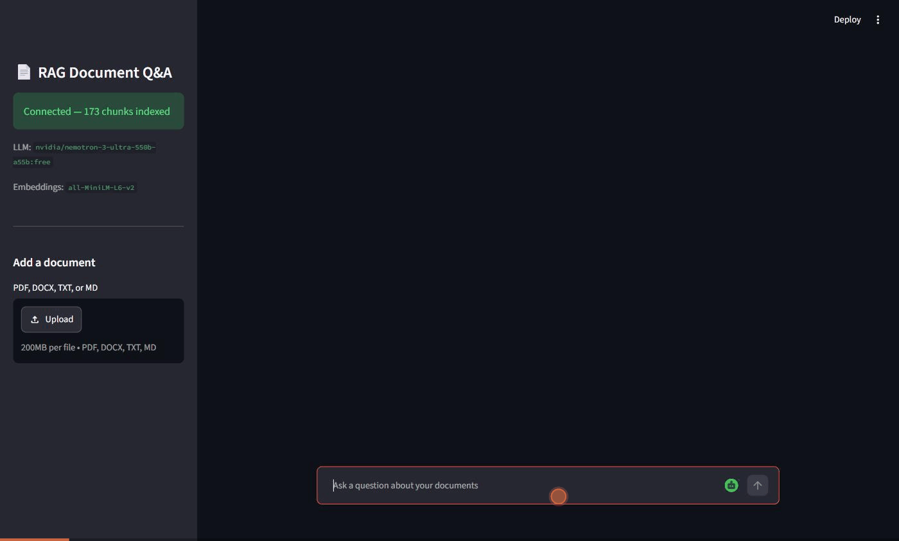

# RAG Document Q&A

[](https://github.com/saberfazliahmadi/rag-document-qa/actions/workflows/ci.yml)
[](LICENSE)
[](https://www.python.org/downloads/)

Ask questions about your own documents and get answers with source citations.

This project is a complete Retrieval-Augmented Generation (RAG) system built in Python, with three interfaces: a **command-line tool**, a **FastAPI REST API** with token streaming, and a **Streamlit chat app**. You give it documents (PDF, Word, text, or Markdown). It stores them in a local vector database. Then you ask questions in plain language, and a large language model answers **using only your documents** — and tells you exactly which parts of which files the answer came from.

What sets it apart from most RAG repositories: retrieval is **two-stage** (hybrid vector + BM25 search, then cross-encoder re-ranking) and **every stage is measured** by a built-in evaluation harness with a golden dataset — including a retrieval regression gate that runs in CI. Not "we added re-ranking because tutorials say so", but "here is the benchmark table showing what it buys and what it costs."



## Why RAG?

Large language models are powerful, but they have two problems: they sometimes invent facts ("hallucination"), and they know nothing about your private files. RAG solves both. The model is only allowed to answer from text retrieved out of your documents, and every answer cites its sources. If the answer is not in your documents, the system says so instead of guessing.

## Key Features

- **Two-stage retrieval** — hybrid search (vector + BM25 fused with Reciprocal Rank Fusion) followed by cross-encoder re-ranking, the same architecture web search engines use
- **Measured, not assumed** — a built-in evaluation harness with a golden dataset proves what each retrieval stage contributes (see the benchmark below)
- **Retrieval regression gate in CI** — a pull request that degrades retrieval quality fails the build automatically
- **Grounded answers with citations** — the LLM answers only from retrieved context; every answer lists the file and chunk it was built from
- **Multi-format ingestion** — reads `.pdf`, `.docx`, `.txt`, and `.md` files into a persistent local ChromaDB index
- **Three interfaces, one core** — a CLI, a documented REST API with token streaming (SSE), and a web chat app
- **No secrets in code** — all configuration comes from environment variables
- **Tested** — unit tests for chunking, fusion math, loaders, metrics, and the API contract

## Tech Stack

| Layer | Technology |
|---|---|
| Language | Python 3.10+ |
| Vector database | ChromaDB (persistent, local) |
| Embeddings | Sentence-Transformers (`all-MiniLM-L6-v2`) |
| Keyword search | BM25 (`rank_bm25`), fused with vectors via RRF |
| Re-ranking | Cross-encoder (`ms-marco-MiniLM-L-6-v2`, local, CPU) |
| LLM access | OpenRouter (OpenAI-compatible API) |
| REST API | FastAPI + Uvicorn (with SSE streaming) |
| Web app | Streamlit |
| Document parsing | PyPDF2, python-docx |
| Testing / CI | pytest, GitHub Actions with a retrieval regression gate |

## Architecture

The pipeline has three stages:

```
 INGESTION                      RETRIEVAL                       GENERATION
┌─────────────────┐          ┌────────────────────┐          ┌─────────────────┐
│ Read document    │          │ Vector search      │          │ Build prompt:    │
│ (PDF/DOCX/TXT)   │          │   +  BM25 search   │          │ context +        │
│       │          │          │        │           │          │ question         │
│ Split into       │          │ Fuse ranks (RRF)   │          │       │          │
│ overlapping      │  ─────▶  │        │           │  ─────▶  │ LLM answers      │
│ chunks           │          │ Re-rank top 20     │          │ from context     │
│       │          │          │ with cross-encoder │          │ only             │
│ Embed + store    │          │        │           │          │       │          │
│ in ChromaDB      │          │ Keep best 4        │          │ Cite sources     │
└─────────────────┘          └────────────────────┘          └─────────────────┘
```

Each module owns one concern:

- `rag/loaders.py` — reads files into plain text
- `rag/splitter.py` — cuts text into overlapping chunks
- `rag/store.py` — ChromaDB vector index + BM25 keyword index, side by side
- `rag/ranking.py` — Reciprocal Rank Fusion and cross-encoder re-ranking
- `rag/retriever.py` — composes the two-stage retrieval pipeline
- `rag/pipeline.py` — retrieval + grounded generation with citations (plain or streaming)
- `rag/config.py` — loads all settings from the environment

The core `rag/` package contains no interface code, so all three interfaces share it:

```
Streamlit chat app (app.py)  ──HTTP──▶  FastAPI REST API (api.py)  ──▶  rag/ package
CLI (main.py)  ──────────────────────────────────────────────────────▶  rag/ package
```

## Why Two-Stage Retrieval?

Dense vector search and keyword search fail in opposite ways:

- **Vector search** finds meaning, so it handles paraphrase ("reducing made-up answers" finds a passage about "hallucination"). But it is weak on exact terms — model numbers, acronyms, error codes often embed poorly.
- **BM25 keyword search** finds exact terms, but it cannot see synonyms.

Because the failure modes are complementary, this project runs both and merges the ranked lists with **Reciprocal Rank Fusion (RRF)**. RRF uses only ranks, never raw scores — BM25 scores and vector distances live on incomparable scales, and RRF sidesteps the problem entirely with no tuning and no training data.

Hybrid search improves *recall* (the right chunk is somewhere in the candidates). A **cross-encoder re-ranker** then improves *precision* (the right chunk is in the final few the LLM actually sees). It reads the query and each candidate together, which makes it far more accurate than embedding distance — and far too slow for a whole corpus, which is why it only scores the top 20 candidates. Retrieve cheap and wide, then re-rank narrow and precise: the same two-stage architecture web search engines use.

Every stage is optional and configurable (`SEARCH_MODE`, `USE_RERANKER`), and — more importantly — every stage is **measured**:

## Evaluation — Measured, Not Assumed

The repository ships an evaluation harness (`eval/`) with a fixed 41-chunk corpus about RAG engineering and a golden dataset of 25 questions, each labeled with the evidence text that answers it. The harness reports two deterministic retrieval metrics:

- **Hit rate@k** — for what fraction of questions is the evidence in the top k retrieved chunks?
- **MRR** (Mean Reciprocal Rank) — how *early* does the evidence appear? A hit at rank 1 scores 1.0, at rank 4 scores 0.25.

Measured results (`python -m eval.run`, top_k = 4):

| Configuration | Hit rate@4 | MRR |
|---|---|---|
| Dense vector search (baseline) | 0.96 | 0.77 |
| Hybrid: BM25 + RRF | **1.00** | 0.87 |
| Hybrid + cross-encoder re-ranking | 0.96 | **0.92** |

What the numbers say — and this honesty is the point of evaluating at all:

- **Hybrid search fixed the baseline's miss** and lifted MRR by 10 points: exact-term questions ("What is a common default value for efConstruction?") that dense search fumbles are caught by BM25.
- **Re-ranking pushed MRR from 0.87 to 0.92** — the evidence lands at the top of the context window, not just inside it.
- **Re-ranking also dropped one question** ("How can a malicious document attack a RAG system?"): the cross-encoder scored other plausible chunks above the evidence. Improvements in one metric can cost another — without an evaluation set, this trade-off would be invisible.

The metrics need no LLM and no API key, so they run in CI on every push: the **retrieval regression gate** (`python -m eval.run --check`) fails the build if hit rate or MRR falls below thresholds. Retrieval quality is protected the same way unit tests protect behavior.

Run it yourself:

```bash
python -m eval.run              # benchmark all three configurations
python -m eval.run --verbose    # also list missed questions
python -m eval.run --check      # regression gate (what CI runs)
```

## Installation

**1. Clone the repository**

```bash
git clone https://github.com/saberfazliahmadi/rag-document-qa.git
cd rag-document-qa
```

**2. Create a virtual environment and install dependencies**

```bash
python -m venv .venv
# Windows:
.venv\Scripts\activate
# macOS / Linux:
source .venv/bin/activate

pip install -r requirements.txt
```

**3. Configure your API key**

```bash
# Windows:
copy .env.example .env
# macOS / Linux:
cp .env.example .env
```

Open `.env` and set `OPENROUTER_API_KEY` to your key from [openrouter.ai/keys](https://openrouter.ai/keys). The default model is free to use.

## Usage

### Web interface (recommended)

Start the API, then the chat app (two terminals):

```bash
uvicorn api:app
streamlit run app.py
```

Open http://localhost:8501, upload a document in the sidebar, and start asking questions. Answers stream in word by word, each with an expandable list of sources.

The REST API can also be used on its own — interactive documentation lives at http://127.0.0.1:8000/docs:

| Endpoint | Method | Purpose |
|---|---|---|
| `/ingest` | POST | Upload a document (multipart file) |
| `/ask` | POST | Ask a question, get a JSON answer with sources |
| `/ask/stream` | POST | Same, but the answer streams token by token (SSE) |
| `/status` | GET | Chunk count and configured models |

### Command line

**Ingest documents** (any mix of PDF, DOCX, TXT, MD):

```bash
python main.py ingest data/sample.txt
python main.py ingest path/to/paper.pdf path/to/notes.docx
```

**Ask a single question:**

```bash
python main.py ask "What are the main benefits of RAG?"
```

**Chat interactively:**

```bash
python main.py chat
```

**Check what is stored:**

```bash
python main.py status
```

## Example Workflow

```text
$ python main.py ingest data/sample.txt
Ingested 'data/sample.txt' -> 4 chunks.

$ python main.py ask "What are the main benefits of RAG?"

=== ANSWER ===
The main benefits of RAG are accuracy and traceability. Because the model
answers from real documents, it is far less likely to invent facts
(hallucination), and every answer can cite the exact chunks it was built
from, so users can verify the sources themselves.

=== SOURCES ===
1. sample.txt (chunk 2)
2. sample.txt (chunk 1)
```

The first run downloads the embedding model (about 90 MB), so it takes a little longer. Later runs start quickly.

## Folder Structure

```
rag-document-qa/
├── main.py              # Command-line interface
├── api.py               # FastAPI REST API (ingest, ask, stream, status)
├── app.py               # Streamlit chat client (talks to the API)
├── rag/
│   ├── config.py        # Settings loaded from environment variables
│   ├── loaders.py       # PDF / DOCX / TXT / MD readers
│   ├── splitter.py      # Overlapping text chunking
│   ├── store.py         # ChromaDB vector index + BM25 keyword index
│   ├── ranking.py       # Reciprocal Rank Fusion + cross-encoder re-ranker
│   ├── retriever.py     # Two-stage retrieval pipeline
│   └── pipeline.py      # Retrieval + grounded generation with citations
├── eval/
│   ├── corpus/          # Fixed evaluation corpus (5 documents)
│   ├── golden.jsonl     # 25 questions labeled with their evidence
│   ├── metrics.py       # Hit rate@k, MRR (deterministic, no LLM)
│   └── run.py           # Benchmark runner + CI regression gate
├── tests/               # Unit tests: chunking, fusion, loaders, metrics, API
├── .github/workflows/   # CI: tests + retrieval regression gate
├── data/sample.txt      # Small demo document
├── assets/demo.gif      # Animated demo of the web app
├── .env.example         # Configuration template (copy to .env)
├── requirements.txt
├── LICENSE
└── README.md
```

The vector database is written to `chroma_db/` at runtime and is not committed to the repository.

## Configuration

All settings have sensible defaults and can be overridden in `.env`:

| Variable | Default | Meaning |
|---|---|---|
| `OPENROUTER_API_KEY` | — (required) | Your OpenRouter API key |
| `LLM_MODEL` | `meta-llama/llama-3.3-70b-instruct:free` | Chat model used for answers |
| `EMBEDDING_MODEL` | `all-MiniLM-L6-v2` | Sentence-transformer embedding model |
| `CHUNK_SIZE` | `500` | Characters per chunk |
| `CHUNK_OVERLAP` | `100` | Characters shared between adjacent chunks |
| `SEARCH_MODE` | `hybrid` | `hybrid` (vector + BM25) or `dense` (vector only) |
| `CANDIDATES` | `20` | First-stage candidates before the final top-k cut |
| `USE_RERANKER` | `true` | Re-score candidates with a cross-encoder |
| `RERANKER_MODEL` | `cross-encoder/ms-marco-MiniLM-L-6-v2` | Local re-ranking model |
| `TOP_K` | `4` | Chunks handed to the LLM per question |
| `TEMPERATURE` | `0.2` | Lower = more factual answers |
| `MAX_TOKENS` | `512` | Maximum answer length |

## Design Decisions

Choices an engineer would ask about, and the reasoning behind them:

- **RRF instead of score normalization.** BM25 scores and vector distances are not comparable, and learned fusion needs training data. RRF uses only ranks, has one well-studied constant, and is the default in most engines offering hybrid search. Boring and correct beats clever here.
- **Custom ~60-line metrics instead of an evaluation framework.** Hit rate and MRR are a few lines of transparent arithmetic. A framework dependency would add setup cost and hide the math this repository is trying to teach. LLM-judged metrics (faithfulness) are deliberately kept out of CI — they are noisy, cost money, and drift with the judge model; deterministic metrics gate the build instead.
- **BM25 index rebuilt in memory at startup.** Honest trade-off: fine at this scale, wasteful at millions of chunks — a production system would keep the keyword index in a search engine (OpenSearch, Elasticsearch). The seam is isolated in `store.py` so that swap touches one module.
- **The golden set is small (25 questions) and the corpus is fixed.** That is enough to expose real differences between configurations (see the miss the re-ranker introduced) while staying reviewable by a human in one sitting. A bigger blind set would be better science; this size is the right cost/benefit for the project.
- **Chunks of 500 characters with 100 overlap** are a measured default, not a truth. Change them and re-run `python -m eval.run` — that workflow, not the numbers, is the point.

## Testing

```bash
pip install -r requirements-dev.txt
pytest                      # unit tests: chunking, RRF math, loaders, metrics, API contract
python -m eval.run --check  # retrieval regression gate
```

The API tests replace the store and pipeline with fakes, so they run in milliseconds without downloading models or calling an LLM. CI runs both commands on every push.

## Future Improvements

- LLM-judged generation metrics (faithfulness, answer relevance) as an optional, non-CI evaluation layer
- Page-accurate citations for PDFs (`file.pdf, p. 12` instead of chunk numbers)
- Sentence-aware chunking instead of fixed character windows — then measure whether it earns its complexity
- Support for more formats (HTML, CSV) and OCR for scanned PDFs
- Multi-user support with per-user collections and authentication

## License

This project is licensed under the [MIT License](LICENSE).
